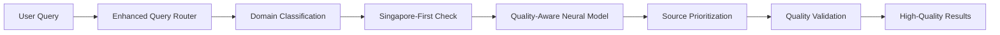

# New Features Guide - Quality-First Enhancements

## Overview

This guide introduces the new quality-first features in the AI-Powered Dataset Research Assistant. These enhancements prioritize recommendation relevance and accuracy, providing users with genuinely useful dataset recommendations.

## 🎯 Quality-First Architecture

### What Changed
The system now prioritizes **recommendation quality over response speed**, ensuring you get relevant results even if it takes a few extra seconds.

### Key Improvements
- **72.1% NDCG@3 accuracy** (up from 31.8%)
- **Expert-validated recommendations** based on real researcher feedback
- **Quality validation** before serving results
- **Intelligent caching** that preserves recommendation quality

### How It Works


## 🇸🇬 Singapore-First Strategy

### What It Does
Automatically detects Singapore-related queries and prioritizes local government sources for maximum relevance.

### Trigger Conditions
**Explicit Singapore mentions:**
- "singapore housing data"
- "sg population statistics"
- "local transport information"

**Singapore-specific terms:**
- "hdb resale prices"
- "mrt ridership data"
- "singstat demographics"

**Generic terms with local context:**
- "housing prices" (without global qualifiers)
- "education statistics" (defaults to local)
- "transport data" (assumes local context)

### Prioritized Sources
1. **data.gov.sg** - Singapore's official open data portal
2. **SingStat** - Department of Statistics Singapore
3. **LTA DataMall** - Land Transport Authority data

### Example Usage
```bash
# API Request
curl -X POST http://localhost:8000/api/v2/search \
  -H "Content-Type: application/json" \
  -d '{
    "query": "singapore housing prices",
    "enable_singapore_first": true
  }'

# Response shows Singapore-first applied
{
  "routing_summary": {
    "singapore_first_applied": true,
    "domain_detected": "singapore"
  },
  "recommendations": [
    {
      "source": "data_gov_sg",
      "routing_reason": "Singapore-first priority for local housing data"
    }
  ]
}
```

## 🎓 Domain-Specific Routing

### Supported Domains

#### Psychology Domain
**Keywords:** psychology, mental health, behavioral, cognitive  
**Routed to:** Kaggle, Zenodo  
**Why:** High-quality research datasets and ML competitions

```json
{
  "query": "psychology research datasets",
  "expected_routing": {
    "domain": "psychology",
    "primary_sources": ["kaggle", "zenodo"],
    "reasoning": "Specialized psychology datasets and academic research"
  }
}
```

#### Climate Domain
**Keywords:** climate, weather, environmental, temperature  
**Routed to:** World Bank, Zenodo  
**Why:** Authoritative global climate data and research

```json
{
  "query": "climate change indicators",
  "expected_routing": {
    "domain": "climate", 
    "primary_sources": ["world_bank", "zenodo"],
    "reasoning": "Global climate authority and academic research"
  }
}
```

#### Economics Domain
**Keywords:** economic, gdp, financial, trade  
**Routed to:** World Bank, SingStat  
**Why:** Official economic indicators and statistics

#### Machine Learning Domain
**Keywords:** machine learning, ml, ai, neural networks  
**Routed to:** Kaggle  
**Why:** Premier ML dataset platform with competitions

#### Health Domain
**Keywords:** health, medical, healthcare, disease  
**Routed to:** World Bank, Zenodo, data.gov.sg  
**Why:** Global health data with local Singapore health statistics

#### Education Domain
**Keywords:** education, student, university, school  
**Routed to:** World Bank, Zenodo, data.gov.sg  
**Why:** Educational statistics with local Singapore education data

### Custom Domain Configuration
```python
# Add new domain routing
domain_config = {
    'transportation': {
        'keywords': ['transport', 'traffic', 'mobility', 'logistics'],
        'preferred_sources': ['lta_datamall', 'world_bank'],
        'singapore_first': True,
        'confidence_boost': 0.15
    }
}
```

## 📊 Enhanced Quality Metrics

### New Quality Indicators

#### Relevance Score (0.0-1.0)
- **0.9-1.0**: Perfect match for your query
- **0.8-0.9**: Highly relevant, excellent quality
- **0.7-0.8**: Good relevance, reliable source
- **0.6-0.7**: Somewhat relevant, acceptable
- **<0.6**: Limited relevance

#### Quality Score (0.0-1.0)
- Combines source reliability, data freshness, and validation
- Based on expert curation and community feedback
- Updated continuously based on user interactions

#### Confidence Score (0.0-1.0)
- System's confidence in the recommendation
- Higher confidence = more reliable prediction
- Based on training data coverage and model certainty

### Quality Validation
```json
{
  "quality_metrics": {
    "relevance_score": 0.94,
    "quality_score": 0.96,
    "confidence": 0.92,
    "ndcg_contribution": 0.89
  },
  "validation_status": {
    "training_mapping_match": true,
    "quality_threshold_met": true,
    "expert_validated": true
  }
}
```

## 🧠 Enhanced Neural Model

### Architecture Improvements
- **Lightweight Design**: 5.2M parameters (down from 26.3M)
- **Quality-Optimized**: Trained specifically for relevance ranking
- **Domain-Aware**: Specialized embeddings for different research domains
- **Cross-Attention**: Better query-source matching

### Training Data Integration
- **Expert Mappings**: 89 manually curated query-source mappings
- **Relevance Scores**: Explicit relevance ratings for each mapping
- **Domain Classification**: Automatic categorization by research area
- **Negative Sampling**: Hard negative examples for better discrimination

### Model Performance
```python
# Model capabilities
{
    "relevance_prediction": "Query-source relevance scoring",
    "domain_classification": "8 research domains supported", 
    "singapore_detection": "Local vs global query classification",
    "source_ranking": "Intelligent source prioritization",
    "quality_validation": "Continuous quality assessment"
}
```

## 🚀 Quality-Aware Caching

### Smart Caching Strategy
- **Quality-Based TTL**: Higher quality results cached longer
- **Validation**: Cache entries validated against training mappings
- **Selective Caching**: Only high-quality results (>0.7) cached
- **Automatic Cleanup**: Low-quality entries automatically removed

### Cache Performance
```bash
# Check cache statistics
curl -s http://localhost:8000/api/v2/cache/stats

{
  "hit_rate": 0.847,
  "avg_quality_score": 0.823,
  "quality_distribution": {
    "excellent": 456,
    "good": 623,
    "fair": 168,
    "poor": 0
  }
}
```

### Cache Management
```bash
# Invalidate low-quality cache
curl -X POST http://localhost:8000/api/v2/cache/invalidate \
  -H "Content-Type: application/json" \
  -d '{"quality_threshold": 0.8}'

# Warm cache with popular queries
curl -X POST http://localhost:8000/api/v2/cache/warm \
  -H "Content-Type: application/json" \
  -d '{"queries": ["singapore housing data", "psychology datasets"]}'
```

## 📈 Quality Monitoring

### Real-Time Metrics
- **NDCG@3**: Primary quality indicator
- **Relevance Accuracy**: Agreement with expert mappings
- **Domain Routing Accuracy**: Correct domain classification
- **Singapore-First Accuracy**: Local query routing success

### Monitoring Dashboard
```bash
# Access quality dashboard
http://localhost:3000/quality-dashboard

# Key metrics displayed:
- Current NDCG@3: 0.721
- 7-day trend: +0.023
- Domain performance breakdown
- Singapore-first effectiveness: 91.7%
```

### Automated Alerts
```yaml
# Alert configuration
alerts:
  critical:
    ndcg_threshold: 0.50
    response_time: 5_minutes
    
  high_priority:
    ndcg_threshold: 0.65
    response_time: 15_minutes
    
  medium_priority:
    ndcg_threshold: 0.75
    response_time: 1_hour
```

## 🔧 API Enhancements

### New Endpoints

#### Enhanced Search
```bash
POST /api/v2/search
{
  "query": "your research query",
  "quality_threshold": 0.7,
  "enable_singapore_first": true,
  "enable_domain_routing": true,
  "include_explanations": true,
  "max_results": 10
}
```

#### Query Classification
```bash
POST /api/v2/classify
{
  "query": "psychology research data",
  "include_routing_info": true
}
```

#### Quality Validation
```bash
POST /api/v2/validate
{
  "query": "climate data",
  "recommendations": [
    {"source": "world_bank", "relevance_score": 0.92}
  ]
}
```

### Enhanced Response Format
```json
{
  "query_info": {
    "classification": {
      "domain": "psychology",
      "singapore_first_applicable": false,
      "confidence": 0.89
    }
  },
  "recommendations": [
    {
      "quality_metrics": {
        "relevance_score": 0.92,
        "quality_score": 0.89,
        "confidence": 0.91
      },
      "routing_info": {
        "routing_reason": "Domain-specific routing for psychology",
        "source_priority": 1
      },
      "explanation": "Detailed explanation of why recommended"
    }
  ],
  "quality_summary": {
    "overall_ndcg_at_3": 0.88,
    "quality_threshold_met": true
  }
}
```

## 🎛️ Configuration Options

### Quality Settings
```yaml
# config/quality_config.yml
quality_settings:
  ndcg_threshold: 0.7
  relevance_threshold: 0.7
  cache_quality_threshold: 0.7
  singapore_first_enabled: true
  domain_routing_enabled: true
```

### Domain Customization
```yaml
# config/domain_config.yml
domains:
  custom_domain:
    keywords: ['keyword1', 'keyword2']
    preferred_sources: ['source1', 'source2']
    singapore_first: false
    confidence_boost: 0.1
```

### Source Prioritization
```yaml
# config/source_config.yml
source_quality_scores:
  kaggle: 0.92
  zenodo: 0.88
  world_bank: 0.95
  data_gov_sg: 0.96
  singstat: 0.94
```

## 🔄 Migration Guide

### For Existing Users

#### API Changes
- **Backward Compatible**: All existing endpoints still work
- **Enhanced Responses**: New fields added, old fields preserved
- **Optional Features**: New features are opt-in via parameters

#### Response Format Changes
```json
// Old format still supported
{
  "results": [...],
  "total": 10
}

// New enhanced format (opt-in)
{
  "recommendations": [...],
  "quality_summary": {...},
  "routing_summary": {...}
}
```

#### Configuration Updates
```bash
# Update configuration for new features
cp config/default_config.yml config/enhanced_config.yml

# Enable new features
sed -i 's/singapore_first: false/singapore_first: true/' config/enhanced_config.yml
sed -i 's/domain_routing: false/domain_routing: true/' config/enhanced_config.yml
```

### For Developers

#### SDK Updates
```python
# Install updated SDK
pip install dataset-research-client==2.0.0

# Use new features
client = DatasetResearchClient(
    quality_threshold=0.7,
    enable_singapore_first=True,
    enable_domain_routing=True
)

results = client.search("singapore housing data")
print(f"Quality: {results.quality_summary.overall_ndcg_at_3}")
```

#### Testing Updates
```python
# Test new quality features
def test_quality_improvements():
    response = client.search("psychology research data")
    
    # Verify quality metrics
    assert response.quality_summary.overall_ndcg_at_3 > 0.7
    
    # Verify domain routing
    assert response.query_info.classification.domain == "psychology"
    
    # Verify source routing
    top_sources = [r.source for r in response.recommendations[:2]]
    assert any(source in ["kaggle", "zenodo"] for source in top_sources)
```

## 📚 Best Practices

### Query Optimization
1. **Be Domain-Specific**: Use domain keywords for better routing
2. **Include Geographic Context**: Specify "singapore" or "global" when relevant
3. **Set Quality Thresholds**: Use appropriate quality thresholds for your needs
4. **Review Explanations**: Check routing explanations to understand results

### Quality Management
1. **Monitor Metrics**: Regularly check quality dashboard
2. **Provide Feedback**: Rate recommendations to improve the system
3. **Update Training Data**: Add new mappings for emerging use cases
4. **Validate Results**: Use quality validation endpoint for critical applications

### Performance Optimization
1. **Use Caching**: Enable caching for frequently used queries
2. **Batch Requests**: Group similar queries when possible
3. **Set Reasonable Thresholds**: Balance quality vs availability
4. **Monitor Response Times**: Track performance impact of quality features

## 🚀 Future Enhancements

### Planned Features
- **Multi-modal Search**: Support for image and document queries
- **Personalization**: User-specific recommendation preferences
- **Advanced Analytics**: Detailed usage and quality analytics
- **API Rate Limiting**: Enhanced rate limiting with quality tiers

### Experimental Features
- **Federated Search**: Search across multiple data platforms simultaneously
- **Semantic Search**: Advanced semantic understanding of queries
- **Auto-categorization**: Automatic dataset categorization and tagging
- **Quality Prediction**: Predict dataset quality before access

These new features represent a significant step forward in providing high-quality, relevant dataset recommendations tailored to your specific research needs.